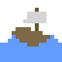

## \*:･ﾟ\*✧:･ﾟ✧ 👋 Good day to you, dear Traveller!! 🗺️ \*:･ﾟ\*✧:･ﾟ✧
#### My name is Simon Chen! Nice to meet you! Welcome aboard my little ship! 🌊 ⚔️ 🍺
> *"Any application that can be written in JavaScript, will eventually be written in JavaScript."* —Jeff Atwood
- 👨‍💻 My favorite 3 things about Computer Science right now are **Git**, the **JS ecosystem**, and **GNU/Linux**
- 🌲 Currently studying Computer Science at the 🏫 **University of Toronto** 🍄
- 🎮 I enjoy making video games, usually in the **Unity** game engine, and I also enjoy 🎨 drawing and animating
- 🚄 Currently learning more about contributing to large open source projects!
- 🌎 Software Engineering Intern at **AMD** (May 2023 - April 2024)
- 🔍 Currently searching for :sparkles: **Software Engineering Internship** :sparkles: positions! (Summer 2024)

---

## 💬 Networking Tavern 🍺
Please feel free to reach out to me at anytime :)

  

