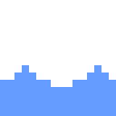

## \*:･ﾟ\*✧:･ﾟ✧ 👋 Good day to you, dear Traveller!! 🗺️ \*:･ﾟ\*✧:･ﾟ✧
#### My name is Simon Chen! Nice to meet you! Welcome aboard my little ship! 🌊 ⚔️ 🍺
> *"Don’t cry because it’s over, smile because it happened."* —Dr. Seuss 
- 👨‍💻 My favourite programming languages are **Python**, **C#**, and **Javascript**
- 🌲 Currently studying Computer Science at the 🏫 **University of Toronto** 🍄!
- 🎮 I enjoy making video games, usually in the Unity game engine, and I also enjoy 🎨 drawing and animating
- 💻 I enjoy participating in hackathons and other fun project events
- 🦌 Currently part of the [UofT Hacks IX](https://uofthacks.com/) exceutive and web development team
- 💪 Currently looking for ✨ *Summer 2022 Software Engineering Internships* ✨

ᛋᛟᛗᛖᛏᛁᛗᛖᛋ ᛁᛚᛚ ᛚᛖᚫᚱᚾ ᚱᚫᚾᛞᛟᛗ ᚦᛝᛋ ᛚᛁᚴᛖ ᚻᛟᚹ ᛏᛟ ᛏᚣᛈᛖ ᚫᚾᛞ ᚱᛖᚫᛞ ᛗᚣ ᛟᚹᚾ ᚱᚢᚾᛁᚳ ᚫᛚᛈᚻᚫᛒᛖᛏ ᛡᚢᛋᛏ ᚠᛟᚱ ᚠᚢᚾ᛫᛫᛫ ᚦᚫᛏᛋ ᛗᚣ ᛋᚻᛁᛈ ᛒᛖᛚᛟᚹ

---
## 🔨 Tools at Sea 🛠️
          

## 👥💬 Networking Tavern 🍺
  

---
